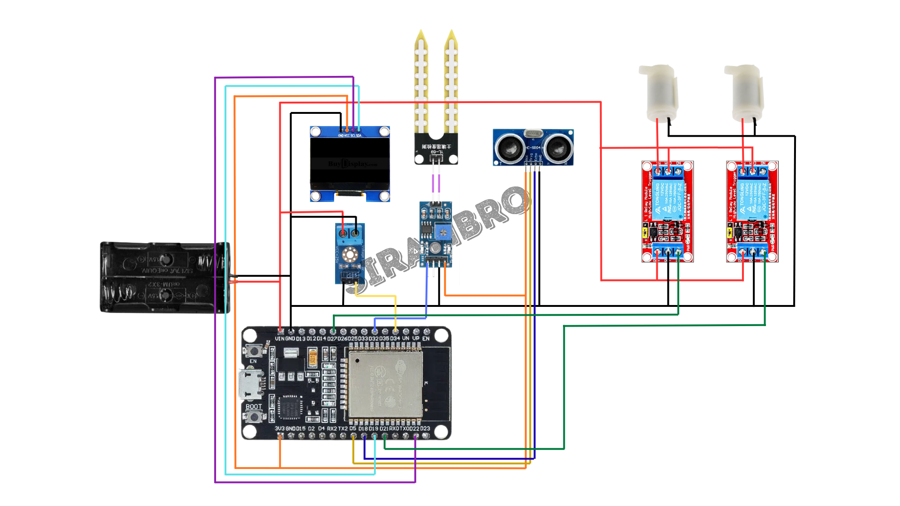

# SiramBro

Simple custom-made IoT devices you can build in case of you keep forgetting to water your plant

## Hardware required

- ESP32
- Relay
- 5V Water Pump
- Battery casing (2S Li-ion battery pack: 6.6V-8.4V)

### Optional hardware

- OLED Display SSD1306 - Display status
- Voltage Sensor - View battery percentage
- Soil Moisture Sensor - Check soil moisture
- Ultrasonic sensor - Check water level

Notes: All the sensors are optional since the pump is all we need, but in some cases that you need more data, sensors might be a gamechanger for your project.

## Hardware Circuit



## Pin Connections

| Component | Pin | ESP32 Pin | Notes |
|-----------|-----|-----------|-------|
| **Pump** | Pump 1 | GPIO 27 | Relay control pin 1 |
| | Pump 2 | GPIO 21 | Relay control pin 2 |
| **OLED Display** | SDA | GPIO 19 | I2C data line |
| | SCL | GPIO 22 | I2C clock line |
| **Voltage Sensor** | Analog In | GPIO 34 | 12-bit ADC (0-4095) |
| **Soil Moisture Sensor** | Analog Out | GPIO 32 | 12-bit ADC (0-4095) |
| **Ultrasonic Sensor** | Trig | GPIO 5 | Trigger pin |
| | Echo | GPIO 18 | Echo pin |

## Required Arduino Libraries

Install these libraries through Arduino Library Manager:

1. **Adafruit SSD1306** - For OLED display
2. **Adafruit GFX Library** - For graphics support
3. **Wire.h** - Included in Arduino core (for I2C communication)
4. **SPI.h** - Included in Arduino core

To install:
1. Open Arduino IDE
2. Go to `Sketch` → `Include Library` → `Manage Libraries`
3. Search for "Adafruit SSD1306" and install
4. Search for "Adafruit GFX Library" and install

## Setup Instructions

1. **Hardware Setup**:
   - Connect all components according to the pin connections table
   - Use proper voltage dividers and level shifters where needed
   - Ensure battery is properly connected

2. **Software Setup**:
   - Install Arduino IDE (version 1.8.x or 2.x)
   - Add ESP32 board support to Arduino IDE:
     - Go to `File` → `Preferences` → `Additional Board Manager URLs`
     - Add: `https://raw.githubusercontent.com/espressif/arduino-esp32/gh-pages/package_esp32_index.json`
     - Go to `Tools` → `Board` → `Boards Manager` → Search for "ESP32" → Install
   - Select your ESP32 board from `Tools` → `Board`
   - Select the correct COM port from `Tools` → `Port`

3. **Upload the Code**:
   - Open `esp32/esp32.ino` in Arduino IDE
   - Click the upload button (→)
   - Wait for compilation and upload to complete

4. **View Serial Output**:
   - Open Serial Monitor (`Tools` → `Serial Monitor`)
   - Set baud rate to 115200
   - You will see sensor readings every second

## Calibration

### Voltage Sensor Calibration

The code includes a calibration factor that may need adjustment:
```cpp
float calibration_factor = 1.21; // adjust once using multimeter
```

To calibrate:
1. Measure the actual battery voltage with a multimeter
2. Compare with the voltage displayed in Serial Monitor
3. Adjust `calibration_factor` in the code:
   - If displayed voltage is lower than actual: increase the factor
   - If displayed voltage is higher than actual: decrease the factor
4. Upload the updated code and verify

## How It Works

The device continuously monitors:

1. **Battery Voltage**: Measures using a voltage divider (R1=30kΩ, R2=7.5kΩ) and calculates battery percentage (6.6V-8.4V range)

2. **Soil Moisture**: Reads analog values (0-4095) and converts to percentage (0-100%)

3. **Water Level**: Uses ultrasonic sensor to measure distance to water surface (in cm)

4. **OLED Display**: Shows all readings in real-time:
   - Battery voltage and percentage
   - Soil moisture percentage
   - Water level distance

5. **Serial Output**: Logs all sensor data every second for debugging and monitoring

### Pump Control (Commented Out)

The pump control code is currently commented out in the `loop()` function. To enable automatic watering, uncomment and configure:

```cpp
digitalWrite(pump1, HIGH);
digitalWrite(pump2, HIGH);
delay(3000);  // Run pump for 3 seconds

digitalWrite(pump1, LOW);
digitalWrite(pump2, LOW);
delay(3000);  // Wait 3 seconds
```

You can modify this to trigger the pump based on soil moisture readings.

## Serial Output Example

```
Distance (cm): 15.23
Distance (inch): 5.99
Moisture = 45.6%
Battery Voltage = 7.85 V | Battery = 68 %
```

## Battery Voltage Range

| Voltage | Percentage | Status |
|---------|------------|--------|
| 8.4V | 100% | Fully charged |
| 8.0V - 8.4V | 75% - 100% | Good |
| 7.6V - 8.0V | 40% - 75% | Moderate |
| 7.2V - 7.6V | 15% - 40% | Low |
| 6.6V - 7.2V | 0% - 15% | Very low (recharge soon) |

## Troubleshooting

- **OLED not displaying**: Check I2C connections (SDA/SCL pins) and address (0x3C)
- **Incorrect voltage readings**: Recalibrate the voltage sensor with a multimeter
- **Moisture sensor always 0% or 100%**: Check if sensor is properly connected to power and ground
- **Ultrasonic sensor giving 0 or very high values**: Ensure sensor is properly oriented and not obstructed
- **Pump not working**: Verify relay connections and that pump pins are correctly set HIGH

## License

This project is open source and available for personal and educational use.
